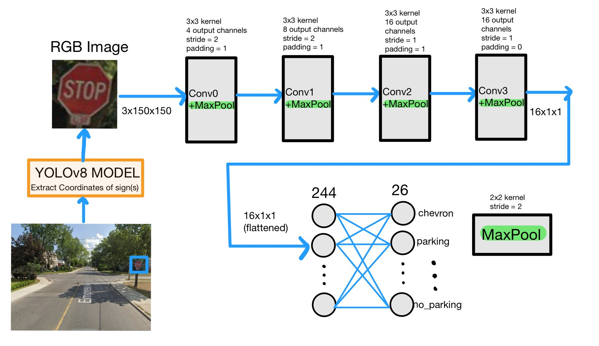
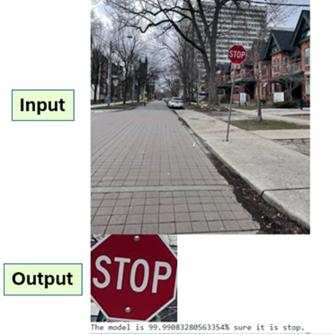

### Project Description
Our project aligns with this goal by aiming to build a robust traffic sign recognition system capable of detecting and classifying various road signs in real-time. The input to our model consists of images from various vehicle-mounted cameras. An effective model should be able to accurately classify signs from different angles, weather conditions, sizes, and lighting conditions. The large variation in image characteristics makes this a complex task that has major applications in the cutting-edge research and development of autonomous vehicles. We tackle this problem by using Convolutional Neural Networks (CNNs) as they can recognize image features from pixels. This allows the model to be trained and tested with raw image data without additional complexities. Its learning capabilities also allow for the necessary extrapolations when working with volatile data from real life driving conditions.

### Model Architecture

### Example Output

